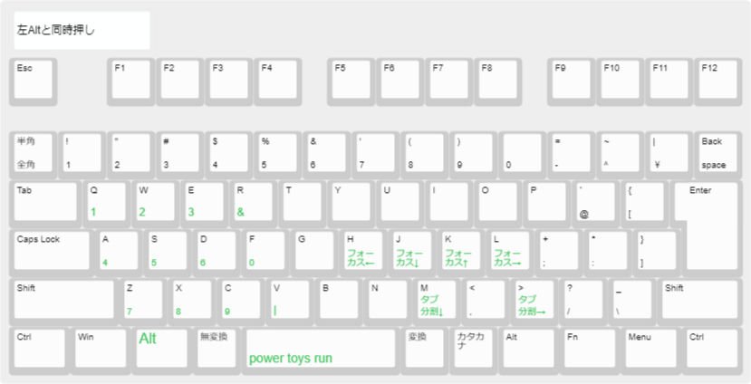

# dotfiles
windowsでのセットアップを行うdotfiles。

## requirement
```
winget install --id Git.Git -e --source winget
```

## install
### windows
```
git -C $HOME clone git@github.com:HirokiMorishita/dotfiles.git .dotfiles
powershell -ExecutionPolicy Unrestricted ./make.ps1
```
ctrl2capの反映には再起動が必要
### wsl
```
ln -s $(wslpath "$(wslvar USERPROFILE)")/.dotfiles ~/.dotfiles
cd ~/.dotfiles
./install.sh
```
### 手動
- [Chrome](https://www.google.com/intl/ja_jp/chrome/)
  - [Vimium](https://chrome.google.com/webstore/detail/vimium/dbepggeogbaibhgnhhndojpepiihcmeb?hl=ja)
- [Docker Desktop](https://www.docker.com/products/docker-desktop/)
- [VSCode](https://code.visualstudio.com/)
- [Kindle](https://www.amazon.co.jp/kindle-dbs/fd/kcp)
- [Slack](https://slack.com/intl/ja-jp/downloads/windows)

## usage
### alias
`a` コマンドか `ctrl+a` でalias一覧表示
### shortcut
`無変換 + p`でショートカット一覧表示
大まかには以下の通り
#### 無変換と同時押し

#### 変換と同時押し

#### LAltと同時押し

## 参考にしたURL
- https://qiita.com/kentac55/items/733bdc21e66b44904332
- https://qiita.com/draganmaistir/items/36bd90fa6c5a93736c70